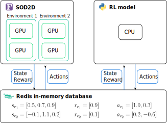

# SmartSOD2D

SmartSOD2D is a communications framework for [SOD2D](https://gitlab.com/bsc_sod2d/sod2d_gitlab) – a spectral-element method (SEM) computational fluid dynamics (CFD) solver – based on [SmartSim](https://github.com/CrayLabs/SmartSim). It allows online training of machine-learning (ML) models among other co-processing possibilities.

## How it works
Most of the high-performance computing CFD solvers are written in low-level languages such as C/C++/Fortran.
On the other hand, ML libraries are typically available in Python, or other high-level languages.
This creates the so-called two-language problem when data needs to be shared across the different processes.
This situation typically arises during online training of ML models, since data needs to be exchanged between the model and the CFD solver.
While the two-language problem can be overcome using Unix sockets or message-passing interface (MPI), SmartSim offers a workflow library providing communication between different instances through an in-memory Redis database.
[SmartRedis](https://github.com/CrayLabs/SmartRedis), the library providing the clients that can connect with the database, is available for C/C++/Fortran/Python languages, hence enabling the communication with any application written in such languages.
The clients offer high-level API calls such as `put_tensor` and `get_tensor` which can be used to send and receive data arrays in a simple manner, thus lowering the overall software complexity of the framework.
Moreover, SmartSim can also be used to manage processes, e.g. to start/stop multiple CFD simulations.

In this framework, SOD2D is used as the CFD solver and [TF-Agents](https://github.com/tensorflow/agents) as the deep reinforcement learning (DRL) library.
SOD2D is a parallel solver that can run both in CPUs and GPUs.
Typically, we launch multiple parallel CFD simulations that feed a DRL agent which can control e.g. the mass flow rate of surface actuators the CFD simulation, hence performing active flow control.
The figure below exemplifies a training scenario and the communication pattern that we follow.
Since the multi-environment DRL technique is naturally parallel and the GPU-enabled CFD solver is parallel too, the current framework has great scalability and can potentially be deployed in exascale machines.

<p align="center">

</p>

## Installation
The basic ingredients necessary to run the current framework are: SOD2D, SmartRedis, SmartSim, and TF-Agents.
Both SOD2D and SmartRedis need to be compiled.
First, we start with SmartRedis, which is then dynamically linked during the compilation of SOD2D.
Aside from the following installation instructions, installation scripts can also be found in [`utils/install_smartredis.sh`](./utils/install_smartredis.sh), [`utils/install_redisai.sh`](./utils/install_redisai.sh), and [`utils/install_smartsod2d.sh`](./utils/install_smartsod2d.sh).

### Loading the modules
The installation of this frameworks relies NVIDIA compilers (NVHPC) or GCC compilers.
Ideally, SOD2D is executed on a GPU backend, so both SOD2D and SmartRedis need to be compiled with NVHPC.
Also, Python > 3.11 is required for the target SmartSim and TF-Agents library versions.
As example, in Marenostrum5-ACC, the following modules need to be loaded to compile SmartRedis and SOD2D, while also being compatible with a GCC-compiled Python version.
```sh
ml purge
ml load nvidia-hpc-sdk/24.3 hdf5/1.14.1-2-nvidia-nvhpcx cmake mkl python/3.11.5-gcc git-lfs gcc/13.2.0-nvidia-hpc-sdk
```
The GCC compilers will be used to compile SmartRedis and RedisAI dependencies.

### SmartRedis
[SmartRedis](https://github.com/CrayLabs/SmartRedis) provides the client class to operate with the in-memory Redis database.
Currently, Currently, we use version 0.5.3 even though newer versions might be available.
SOD2D and SmartRedis need to be compiled with the same compiler so that they can be linked afterwards.
NVIDIA compilers (NVHPC) support has been integrated into SmartRedis, so we can use NVHPC to compile both SmartRedis and SOD2D.
After loading the appropiate modules, compile the SmartRedis Fortran library with NVHPC as follows
```sh
git clone https://github.com/CrayLabs/SmartRedis --depth=1 --branch=v0.5.3 smartredis && cd smartredis
make lib-with-fortran CC=nvc CXX=nvc++ FC=nvfortran
```
On the other hand, GCC compilers can be used too if SOD2D is intended to run on CPUs only.
To compile SmartRedis with GCC compilers run
```sh
make lib-with-fortran CC=gcc CXX=g++ FC=gfortran
```

### RedisAI
SmartRedis also depends on RedisAI, which needs to be downloaded, compiled with GCC, and installed.
This can be done as follows
```sh
git clone --recursive https://github.com/RedisAI/RedisAI --depth=1 --branch=v1.2.7 redisai && cd redisai
bash get_deps.sh
mkdir build && cd build
cmake .. -DBUILD_TORCH=OFF
make -j
make install
```

### Add SmartRedis and RedisAI paths into system path
Last, the installation paths of both libraries need to be exported in the following environmental variables
```sh
export SMARTREDIS_DIR=smartredis/install
export RAI_PATH=redisai/install-cpu/redisai.so
export SMARTSIM_REDISAI=1.2.7
export PATH=$SMARTREDIS_DIR/bin:$PATH
export LD_LIBRARY_PATH=$SMARTREDIS_DIR/lib:$LD_LIBRARY_PATH
```

### SOD2D
[SOD2D](https://gitlab.com/bsc_sod2d/sod2d_gitlab) is an open-source SEM CFD solver.
In its repository, there are detailed instructions for the compilation of the solver in different architectures, as well as general information about its features and how to use the solver.
Note that the branch devoted to the integration of SOD2D with SmartSim/SmartRedis is the [82-smartredis-integration](https://gitlab.com/bsc_sod2d/sod2d_gitlab/-/tree/82-smartredis-integration) branch.
SOD2D is already included in this repository as a submodule pointing to this specific branch.
To download and initialize the submodule just run:
```sh
git submodule update --init --recursive
```
Or include the `--recurse-submodules --remote-submodules` flags when cloning this repository.

SOD2D sets up different cases through its main classes files, and this is selected by the [`sod2d.f90`](https://gitlab.com/bsc_sod2d/sod2d_gitlab/-/blob/master/src/app_sod2d/sources/sod2d.f90) file.
An example class that incorporates SmartRedis integration can be found in [`BLMARLFlowSolverIncomp.f90`](https://gitlab.com/bsc_sod2d/sod2d_gitlab/-/blob/82-smartredis-integration/src/lib_mainBaseClass/sources/BLMARLFlowSolverIncomp.f90), which implements an adverse-pressure gradient turbulent boundary layer. Active flow control is performed using TF-agents with the objective of reducing the turbulent separation bubble. The communication routines are contained within this class and the [`mod_smartredis.f90`](https://gitlab.com/bsc_sod2d/sod2d_gitlab/-/blob/82-smartredis-integration/src/lib_sod2d/sources/mod_smartredis.f90) module in SOD2D.

To compile SOD2D and link it with SmartRedis, the following `cmake` command can be used
```sh
cd smartsod2d/sod2d_gitlab
mkdir build && cd build
unset LDFLAGS
cmake -DUSE_GPU=ON -DUSE_MEM_MANAGED=OFF -DUSE_SMARTREDIS=ON
make -j
```
This will compile SOD2D for GPU execution and the resulting binary will be found in `./sod2d_gitlab/build/src/app_sod2d/sod2d`.
This executable needs to be copied to the relevant directory of the case to be run (more on this in the ["Run a case"](#run-a-case) section).
Also, note that platform-specific flags can be used when configuring SOD2D such as `-DUSE_MN5=ON`.

### SmartSim and TF-agents
It is recommended to create a Python environment so that all the Python dependencies of SmartSOD2D are installed there using `pip`, while also unseting the system Python library path.
This can be done as follows
```sh
unset PYTHONPATH
python -m venv smartsod2d-env
source smartsod2d-env/bin/activate
pip install smartsim==0.7.0 # install smartredis==0.5.3
smart build --device cpu --no_pt --no_tf
pip install tf_agents==0.19.0 # installs tensorflow-2.15.1, keras-2.15.0
```
Finally, SmartSOD2D can be installed in the `smartsod2d-env` environment with
```sh
cd smartsod2d
pip install -e .
```
This will mark the current package as editable, so it can be modified and the changes will be automatically available to the Python environment.

## Run a case
Create a directory that contains the following files
 - `sod2d`: The SOD2D executable.
 - `mesh-1.hdf`: The mesh file used by SOD2D. More information [here](https://gitlab.com/bsc_sod2d/sod2d_gitlab/-/wikis/Documentation/Running/Mesh-generation).
 - Files relevant to the SOD2D class.
 For example in the [`BLMARLFlowSolverIncomp.f90`](https://gitlab.com/bsc_sod2d/sod2d_gitlab/-/blob/82-smartredis-integration/src/lib_mainBaseClass/sources/BLMARLFlowSolverIncomp.f90) class, the case directory needs to include the `witness.txt` and `rectangleControl.txt` files that specify the witness points location and the geometry of the actuators, respectively.
 - `run.py`: The Python file that initalizes SmartSim and the Redis database, and implements the relevant ML model.
 See an example in [`examples/bl_rl/run.py`](./examples/bl_rl/run.py).
 - `params.py`: The Python file containing all the parameters regarding SmartSim, the ML model, and the environmental modules.
 See an example in [`examples/bl_rl/params.py`](./examples/bl_rl/params.py).
 - `run.sh`: The job submission file when working in a cluster environment.

There are two different strategies to run SOD2D when using the SmartSim process manager:
1. Allocate all the required resources (number of GPUs, walltime, etc) on the `run.sh` file.
See [`examples/bl_rl/job_mn5.sh`](./examples/bl_rl/job_mn5.sh).
In a SLURM environment, this could be
```sh
#!/bin/bash
#SBATCH --job-name=smartsod2d
#SBATCH --account=bsc21
#SBATCH --qos=acc_bsccase
#SBATCH --output=slurm-%j.out
#SBATCH --error=slurm-%j.err
#SBATCH --ntasks=4
#SBATCH --cpus-per-task=20
#SBATCH --gres=gpu:4
#SBATCH --time=48:00:00
. ../../utils/modules-mn5-acc.sh
python run.py
```
In this case, we would allocate 4 GPUs for 2 days. Note that both the Python modules (and virtual environment) as well as the NVHPC compilers need to be loaded in the same environment (and hence compatible when using environmental modules).
This method is activated by using `launcher: "slurm"` in the parameters file.

2. Allocate a CPU and use it to launch GPU jobs every time a simulation with SOD2D needs to be launched (for example as a training episode).
This method is activated by using `launcher: "slurm-split"` in the parameters file, which loads the modules for SOD2D specified in the `sod2d_modules` file.
This mode can be run as detailed in [`examples/bl_rl/job_alvis.sh`](./examples/bl_rl/job_alvis.sh).
In a SLURM environment,
```sh
#!/bin/bash
#SBATCH --job-name=marl4
#SBATCH --output=slurm-%j.out
#SBATCH --error=slurm-%j.err
#SBATCH -C NOGPU -n 1 # CPU only node, but this is cluster dependant
#SBATCH --time=168:00:00
. ../../utils/modules-alvis-python.sh # bash file containing the Python environment modules.
python run.py
```
In this case, we could allocate a CPU core for a week which would then submit the specific SOD2D jobs on the GPU nodes. The parameters of these jobs can be passed through the [`examples/bl_rl/params.py`](./examples/bl_rl/params.py) options such as
  - `launcher: "slurm-split"`: activates this "subjob" approach.
  - `sod2d_modules`: the file containing the NVHPC compilers modules to run SOD2D.
  - `episode_walltime`: wall-time (duration) of the episode.
  - `cluster_account`: account to attach job to (if necessary)

The total number of requested GPUs will be the number of parallel environments (`cfd_n_envs`) times the number of tasks per environment (`n_tasks_per_env`).

## Cite us!

Plese cite our paper
```
@article{Font2024,
  title = {Active flow control of a turbulent separation bubble through deep reinforcement learning},
  author = {Font, Bernat and Alcántara-Ávila, Francisco and Rabault, Jean and Vinuesa, Ricardo and Lehmkuhl,  Oriol},
  volume = {2753},
  ISSN = {1742-6596},
  DOI = {10.1088/1742-6596/2753/1/012022},
  number = {1},
  journal = {Journal of Physics: Conference Series},
  year = {2024},
  pages = {012022}
  eprint = {https://arxiv.org/pdf/2403.20295}
}
```
And, if you find it useful, please cite the repo too:
```
@misc{SmartSOD2D,
  author = {Font, Bernat and Alcántara-Ávila, Francisco and Rabault, Jean and Vinuesa, Ricardo and Lehmkuhl,  Oriol},
  title = {SmartSOD2D: A machine-learning framework for the {SOD2D CFD} solver},
  year = {2024},
  publisher = {GitHub},
  journal = {GitHub repository},
  url = {https://github.com/b-fg/SmartSOD2D}
}
```

## Acknowledgements
This work was supported in part by the European Research Council (ERC) under the Caust grant ERC-AdG-101018287. OL has been partially funded by the European Commission’s Horizon 2020 Framework program and the European High-Performance Computing Joint Undertaking (JU) under grant agreement no. 101093393, and by MCIN/AEI/10.13039/501100011033 and the European Union NextGenerationEU/PRTR (PCI2022-134996-2), project CEEC. OL has been partially supported by a Ramon y Cajal postdoctoral contract (Ref: RYC2018-025949-I). RV and FAA acknowledge financial support from ERC grant no. ‘2021-CoG-101043998, DEEPCONTROL’. This package has been partially inspired by [Relexi](https://github.com/flexi-framework/relexi).


